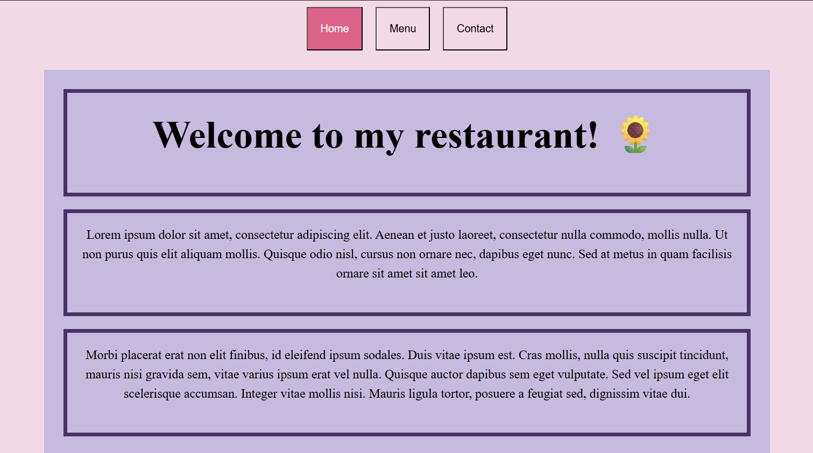
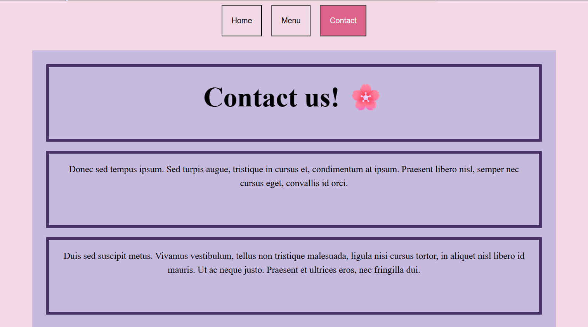
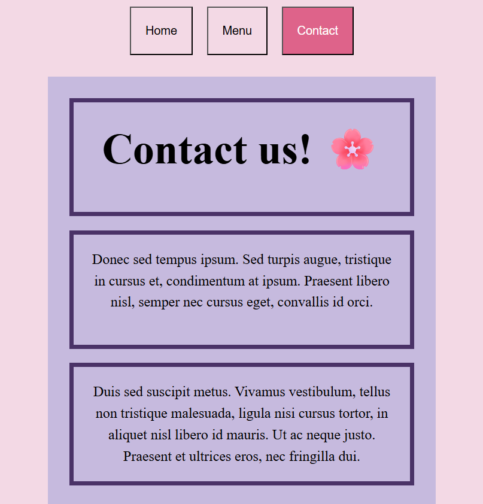

# Restaurant

This is a simple assignment where I revised the following:
- Webpack concepts (webpack.config, webpack cli, src/dist)
- Related Git concepts (gitignore, git branch deployment when pushing webpack)
- Tabbed browsing
- The only "effect" is that when a tab is clicked, the corresponding button shows as selected.

